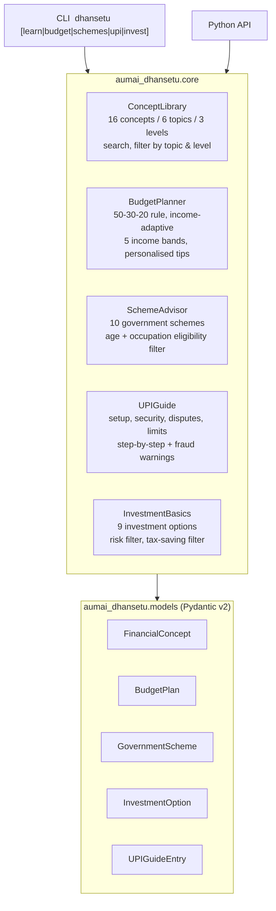

# aumai-dhansetu

> **DhanSetu** (धनसेतु) — "Bridge to Wealth". An AI-powered financial literacy toolkit built for India's 1.4 billion people, from first-time bank account holders to salaried professionals navigating the tax code.

[](https://github.com/aumai/aumai-dhansetu/actions)
[](https://www.python.org/downloads/)
[](LICENSE)

---

> **REGULATORY DISCLAIMER:** aumai-dhansetu is an educational and informational tool only. It does **NOT** provide SEBI-registered investment advisory services. All interest rates, scheme benefits, and tax figures are indicative and subject to change by the relevant authority (RBI, SEBI, PFRDA, IRDAI, Ministry of Finance). Past performance does not guarantee future results. Verify all financial information with official government portals and consult a SEBI-registered financial advisor before making investment, insurance, or tax decisions. Nothing in this package constitutes financial advice.

---

## What is aumai-dhansetu?

Imagine you are a first-generation bank account holder in a small town in Chhattisgarh. Someone tells you to "invest in mutual funds" and "use UPI for payments". These words might as well be in a foreign language.

aumai-dhansetu is the patient, jargon-free teacher for that person — and for everyone between that person and a senior professional optimising their tax strategy.

Think of it as a financial literacy encyclopaedia for India, bundled with practical tools:

- A **concept library** that explains 16 financial topics, from "what is a savings account?" to "how does Section 80C work?" — at three literacy levels
- A **budget calculator** that splits your salary using an income-adapted version of the 50/30/20 rule
- A **government scheme matcher** that surfaces the free benefits you are already entitled to (PMJDY, APY, PMJJBY, PM-KISAN, and more)
- A **UPI safety guide** covering setup, fraud prevention, dispute resolution, and transaction limits
- An **investment comparison table** that puts PPF, SIP, NPS, and gold bonds side by side

## Why does this matter?

India has built world-class financial infrastructure. Over 500 million Jan Dhan accounts have been opened. UPI processes over 10 billion transactions every month. Government schemes provide life insurance for Rs 436/year and pension coverage starting at Rs 42/month.

But financial literacy has not kept pace. People lose lakhs to UPI scams because nobody told them "you never enter your PIN to receive money." Families miss PMJJBY's Rs 2 lakh life cover because the bank never explained it at account opening. First-generation investors put emergency funds in equity mutual funds because nobody differentiated "low risk" from "high risk."

aumai-dhansetu is the missing bridge — between India's financial infrastructure and the average citizen's ability to use it confidently and safely.

## Architecture



All data is embedded in the package. No external API calls, no internet connection required, no secrets.

## Features

### Financial Concept Library
- 16 built-in concepts covering Savings, Insurance, Investment, Credit, Taxation, and Digital Payments
- Three difficulty levels: Beginner, Intermediate, Advanced
- Full-text keyword search across title and explanation
- Filter by topic, by level, or both simultaneously
- Each concept includes real-world Indian examples and a key-terms glossary

### Budget Planner (50/30/20 Rule)
- Generates a monthly spending plan tailored to five income bands
- Needs/Wants/Savings ratios shift with income (65/15/20 at very low income, 40/25/35 at high income)
- Three personalised, actionable recommendations per income band
- Emergency fund goal: 3 months at low income, 6 months at higher income

### Government Scheme Advisor
- 10 real central government schemes with full details: PMJDY, APY, PMJJBY, PMSBY, PM-KISAN, SSY, SCSS, NPS, PMMY, Stand Up India
- Eligibility filtering by age and occupation category
- Partial-name scheme lookup
- Full application instructions and ministry references for every scheme

### UPI Guide
- Four topic areas: `setup`, `security`, `disputes`, `limits`
- Numbered, ordered steps for each guide
- Security guide includes explicit fraud warnings (QR scam, OTP scam, collect request scam)
- Disputes guide covers the full three-tier escalation: UPI app → bank → NPCI portal → RBI CMS portal

### Investment Basics
- 9 instruments from Post Office RD (Rs 100 minimum) to Sovereign Gold Bonds
- Filter by risk level: low, moderate, high
- Filter for 80C tax-saving eligible options
- `for_beginner()` shortcut returns only low-risk instruments

### CLI Interface
Five subcommands with `--json-output` flag for every command that returns structured data.

---

## Quick Start

### Installation

```bash
pip install aumai-dhansetu
```

Install from source (development mode):

```bash
git clone https://github.com/aumai-org/aumai-dhansetu.git
cd aumai-dhansetu
pip install -e ".[dev]"
```

Verify installation:

```bash
dhansetu --version
dhansetu learn --level beginner
```

### Python API — 60-Second Tour

```python
from aumai_dhansetu.core import (
    ConceptLibrary,
    BudgetPlanner,
    SchemeAdvisor,
    UPIGuide,
    InvestmentBasics,
)
from aumai_dhansetu.models import FinancialTopic, LiteracyLevel

# 1. Learn about digital payments
library = ConceptLibrary()
concepts = library.get_by_topic(FinancialTopic.DIGITAL_PAYMENTS)
for c in concepts:
    print(f"[{c.level.value}] {c.title}")
# [beginner] UPI (Unified Payments Interface)
# [beginner] Digital Payment Security

# 2. Build a budget plan for Rs 35,000/month
planner = BudgetPlanner()
plan = planner.plan(monthly_income=35_000)
print(plan.allocations)
# {'needs': 17500.0, 'wants': 8750.0, 'savings': 8750.0}
for rec in plan.recommendations:
    print(f" - {rec}")

# 3. Find government schemes for a 30-year-old farmer
advisor = SchemeAdvisor()
schemes = advisor.find_eligible(age=30, occupation="farmer")
for s in schemes:
    print(f"{s.name}: {s.benefits[:70]}")

# 4. UPI security guide
guide = UPIGuide()
entry = guide.get_guide("security")
for step in entry.steps:
    print(step)
for warning in entry.warnings:
    print(f"WARNING: {warning}")

# 5. Low-risk investment options
basics = InvestmentBasics()
for opt in basics.for_beginner():
    print(f"{opt.name}: {opt.expected_return_pct} | Rs {opt.min_investment:,.0f} minimum")
```

---

## CLI Reference

### `dhansetu learn` — Financial Concepts

Explore the built-in financial literacy library.

```
Usage: dhansetu learn [OPTIONS]

Options:
  --topic   [savings|insurance|investment|credit|taxation|digital_payments]
  --level   [beginner|intermediate|advanced]
  --search  TEXT    Keyword search across title and explanation
  --json-output     Output raw JSON instead of formatted text
  --help            Show this message and exit.
```

**Examples:**

```bash
# Show all beginner-level concepts
dhansetu learn --level beginner

# Investment concepts at intermediate level
dhansetu learn --topic investment --level intermediate

# Search for anything about "SIP"
dhansetu learn --search "SIP"

# Search for CIBIL/credit score information
dhansetu learn --search "CIBIL"

# Insurance concepts, machine-readable output
dhansetu learn --topic insurance --json-output
```

**Sample output:**

```
============================================================
  UPI (Unified Payments Interface)
  Topic: digital_payments | Level: beginner
============================================================

Instant bank-to-bank transfer using mobile phone. Free of charge. Works
24/7. Send/receive money using UPI ID (yourname@bank), phone number, or
QR code. Daily limit typically Rs 1 lakh.

Examples:
  - Pay shopkeeper via PhonePe QR scan
  - Send money via Google Pay

Key terms: UPI ID, VPA, QR code, UPI PIN
```

---

### `dhansetu budget` — Monthly Budget Planner

Generate a personalised budget plan based on monthly income.

```
Usage: dhansetu budget [OPTIONS]

Options:
  --income  FLOAT   Monthly income in INR  [required]
  --json-output     Output as JSON
  --help            Show this message and exit.
```

**Examples:**

```bash
# Budget for Rs 18,000/month (entry-level salary)
dhansetu budget --income 18000

# Budget for Rs 60,000/month
dhansetu budget --income 60000

# JSON output for downstream processing
dhansetu budget --income 50000 --json-output
```

**Sample output for `--income 20000`:**

```
==================================================
  Budget Plan for Rs 20,000/month
==================================================

  NEEDS       : Rs     11,000  (55%)
  WANTS       : Rs      4,000  (20%)
  SAVINGS     : Rs      5,000  (25%)

  Savings target: Rs 5,000/month
  Emergency fund goal: 6 months of expenses

Recommendations:
  1. Start a small RD of Rs 500-1000/month to build savings habit.
  2. Get health insurance (at least Rs 3L family floater).
  3. Consider Atal Pension Yojana for retirement security.
```

---

### `dhansetu schemes` — Government Scheme Finder

Discover central government schemes you are eligible for.

```
Usage: dhansetu schemes [OPTIONS]

Options:
  --age         INTEGER   Your age
  --income      FLOAT     Annual income in INR
  --occupation  TEXT      e.g. farmer, salaried, self-employed, women
  --json-output           Output as JSON
  --help                  Show this message and exit.
```

**Examples:**

```bash
# All schemes without filters
dhansetu schemes

# Schemes for a 35-year-old
dhansetu schemes --age 35

# Schemes for a farmer aged 45
dhansetu schemes --age 45 --occupation farmer

# Senior citizen schemes
dhansetu schemes --age 62

# JSON output for integration
dhansetu schemes --age 30 --json-output
```

---

### `dhansetu upi` — UPI Guidance

Step-by-step UPI guidance on setup, security, disputes, and limits.

```
Usage: dhansetu upi [OPTIONS]

Options:
  --topic  [setup|security|disputes|limits]  [required]
  --help                                      Show this message and exit.
```

**Examples:**

```bash
# First-time UPI setup walkthrough
dhansetu upi --topic setup

# How to avoid fraud and scams
dhansetu upi --topic security

# Transaction failed or wrong payment — what to do
dhansetu upi --topic disputes

# Daily limits, per-transaction limits, UPI Lite
dhansetu upi --topic limits
```

---

### `dhansetu invest` — Investment Comparison

Compare and filter investment options for Indian retail investors.

```
Usage: dhansetu invest [OPTIONS]

Options:
  --risk        [low|moderate|high]   Filter by risk level
  --tax-saving                        Show only 80C tax-saving options
  --json-output                       Output as JSON
  --help                              Show this message and exit.
```

**Examples:**

```bash
# Full comparison table
dhansetu invest

# Safe options only
dhansetu invest --risk low

# Tax-saving investments (Section 80C eligible)
dhansetu invest --tax-saving

# Market-linked moderate risk options
dhansetu invest --risk moderate
```

**Sample output for `dhansetu invest --risk low`:**

```
Investment                     Risk       Return     Lock-in    Tax Benefit  Min Invest
-----------------------------------------------------------------------------------------------
Public Provident Fund (PPF)    low        7.1%       15.0yr     Yes (80C)    Rs 500
Fixed Deposit (FD)             low        6.5-7.5%   0.2yr      No           Rs 1,000
Recurring Deposit (RD)         low        6.5-7%     0.5yr      No           Rs 100
Debt Mutual Fund               low        6-8%       None       No           Rs 500
Sukanya Samriddhi (SSY)        low        8.2%       21.0yr     Yes (80C)    Rs 250
```

---

## Python API Examples

### Progressive learning path

```python
from aumai_dhansetu.core import ConceptLibrary
from aumai_dhansetu.models import FinancialTopic, LiteracyLevel

library = ConceptLibrary()

# Start with all beginner concepts
print("=== BEGINNER LEARNING PATH ===")
for concept in library.get_by_level(LiteracyLevel.BEGINNER):
    print(f"  [{concept.topic.value}] {concept.title}")

# Drill into a topic
print("\n=== EVERYTHING ABOUT SAVINGS ===")
for concept in library.get_by_topic(FinancialTopic.SAVINGS):
    print(f"  [{concept.level.value}] {concept.title}")
    print(f"  {concept.explanation[:100]}...")

# Search for a specific term
print("\n=== SEARCH: 80C ===")
for concept in library.search("80C"):
    print(f"  {concept.title}: {concept.explanation[:80]}...")
```

### Multi-income household planning

```python
from aumai_dhansetu.core import BudgetPlanner

planner = BudgetPlanner()

incomes = [12000, 25000, 50000, 85000, 150000]
print(f"{'Income':>12s}  {'Needs':>10s}  {'Wants':>10s}  {'Savings':>10s}")
for income in incomes:
    plan = planner.plan(income)
    needs = plan.allocations["needs"]
    wants = plan.allocations["wants"]
    savings = plan.allocations["savings"]
    print(f"Rs {income:>8,}  Rs {needs:>8,}  Rs {wants:>8,}  Rs {savings:>8,}")
```

### Complete scheme eligibility audit

```python
from aumai_dhansetu.core import SchemeAdvisor

advisor = SchemeAdvisor()

# Build profiles for a village household
profiles = [
    {"name": "Ramesh (farmer, 40)", "age": 40, "occupation": "farmer"},
    {"name": "Sunita (housewife, 35)", "age": 35, "occupation": ""},
    {"name": "Dadi (senior, 65)", "age": 65, "occupation": ""},
    {"name": "Baby Priya (girl, 5)", "age": 5, "occupation": ""},
]

for profile in profiles:
    schemes = advisor.find_eligible(
        age=profile["age"],
        occupation=profile.get("occupation"),
    )
    print(f"\n{profile['name']}: {len(schemes)} eligible schemes")
    for s in schemes:
        print(f"  - {s.name}")
```

### Investment strategy by risk appetite

```python
from aumai_dhansetu.core import InvestmentBasics

basics = InvestmentBasics()

print("=== CONSERVATIVE PORTFOLIO (low risk only) ===")
for opt in basics.by_risk("low"):
    tax = "Tax benefit" if opt.tax_benefit else "No tax benefit"
    print(f"  {opt.name}: {opt.expected_return_pct} returns, {tax}")

print("\n=== TAX-SAVING OPTIONS (80C eligible) ===")
for opt in basics.tax_saving():
    print(f"  {opt.name}: {opt.lock_in_years}yr lock-in, Rs {opt.min_investment:,} min")

print("\n=== COMPLETE COMPARISON ===")
all_options = basics.compare_all()
print(f"  Total instruments available: {len(all_options)}")
```

---

## Configuration

aumai-dhansetu is a pure-Python, offline library. No API keys, no environment variables, no config files.

### Extending the concept library at runtime

```python
from aumai_dhansetu.core import ConceptLibrary
from aumai_dhansetu.models import FinancialConcept, FinancialTopic, LiteracyLevel

library = ConceptLibrary()
library._concepts.append(FinancialConcept(
    topic=FinancialTopic.SAVINGS,
    title="Kisan Vikas Patra (KVP)",
    explanation="Post Office savings instrument that doubles your money in a fixed period. Available in denominations from Rs 1,000.",
    examples=["Rs 10,000 KVP doubles in 115 months at current rates"],
    level=LiteracyLevel.BEGINNER,
    key_terms=["maturity", "post office", "doubling period"],
))
```

### Adding regional or state schemes

```python
from aumai_dhansetu.core import SchemeAdvisor
from aumai_dhansetu.models import GovernmentScheme

advisor = SchemeAdvisor()
advisor._schemes.append(GovernmentScheme(
    name="Ladli Laxmi Yojana (MP)",
    description="Financial assistance to girl children in Madhya Pradesh.",
    eligibility="Girl child born after 1 January 2006 to BPL family in MP",
    benefits="Rs 1,18,000 in installments over the girl's life stages",
    how_to_apply="Apply at Anganwadi centre or online at ladlilaxmi.mp.gov.in",
    ministry="Government of Madhya Pradesh",
    target_group="girl_child",
))
```

---

## How It Works — Deep Dive

### ConceptLibrary internals

The library maintains a list of `FinancialConcept` Pydantic objects. Filtering is simple list comprehension; search is case-insensitive substring matching across `title` and `explanation`. This is intentionally simple — no vector embeddings, no LLM calls — making it fast, offline, and deterministic.

### BudgetPlanner logic

The planner uses an income-adaptive variant of the 50/30/20 rule:

| Monthly Income Band | Needs | Wants | Savings | Rationale |
|---|---|---|---|---|
| Below Rs 15,000 | 65% | 15% | 20% | Fixed costs dominate at low income |
| Rs 15,000–24,999 | 55% | 20% | 25% | Small savings habit formation |
| Rs 25,000–49,999 | 50% | 25% | 25% | Classic 50/30/20 territory |
| Rs 50,000–99,999 | 45% | 25% | 30% | Growing discretionary + investment |
| Rs 1,00,000+ | 40% | 25% | 35% | Fixed costs as smaller fraction |

Emergency fund months: 3 for incomes below Rs 25K (build gradually), 6 for higher incomes (standard guidance).

### SchemeAdvisor eligibility logic

Eligibility uses three checks applied in order:
1. Age range: `min_age` and `max_age` on each scheme (some schemes have no age restriction)
2. Target group: each scheme has a `target_group` field (farmers, girl_child, senior_citizens, sc_st_women, unbanked, all, etc.)
3. The filter is intentionally permissive — missing profile data never excludes a scheme

### UPIGuide structure

Each `UPIGuideEntry` contains: ordered `steps` list (actionable), `tips` list (best practices), and `warnings` list (fraud alerts). The `security` guide has the most warnings — it is the most important guide for new users.

### InvestmentBasics catalogue

Nine instruments covering the full Indian retail investment universe from risk = low (RD, FD, PPF) through risk = moderate (NPS, Index Fund, Gold Bond) to risk = high (ELSS). Minimum investments range from Rs 100 (RD) to Rs 4,500 (Sovereign Gold Bond). All return figures are historical/indicative ranges, labelled explicitly in the disclaimer.

---

## Integration with Other AumAI Projects

aumai-dhansetu is part of the AumAI India Sovereign Domain suite:

| AumAI Project | Integration |
|---|---|
| **aumai-smartgram** | Gram panchayat officers can run dhansetu scheme matching alongside village governance workflows |
| **aumai-jaldrishti** | Both share the India Sovereign Domain compliance pattern: embedded disclaimers, plain-language output, Pydantic validation |
| **aumai-specs** | Pydantic model conventions from aumai-specs inform the `models.py` design |

```python
# Combined workflow: village officer checking schemes for residents
from aumai_dhansetu.core import SchemeAdvisor

advisor = SchemeAdvisor()

# After identifying village demographics in smartgram...
farmer_schemes = advisor.find_eligible(occupation="farmer")
senior_schemes = advisor.find_eligible(age=65)

print(f"Farmer schemes available: {len(farmer_schemes)}")
print(f"Senior citizen schemes: {len(senior_schemes)}")
```

---

## Contributing

```bash
git clone https://github.com/aumai-org/aumai-dhansetu.git
cd aumai-dhansetu
pip install -e ".[dev]"
make test      # pytest
make lint      # ruff + mypy strict
make format    # ruff format
```

All contributions must:
- Pass `mypy --strict` (no `Any`, no untyped functions)
- Include tests alongside new functionality
- Follow conventional commit format (`feat:`, `fix:`, `docs:`, `test:`, `chore:`)
- Include an official source reference (RBI circular, Ministry notification, SEBI regulation) for any new scheme or financial figure added

See [CONTRIBUTING.md](CONTRIBUTING.md) for the full guide.

---

## License

Apache License 2.0. See [LICENSE](LICENSE).

---

*aumai-dhansetu is part of the [AumAI](https://github.com/aumai-org) open source project — building sovereign AI infrastructure for India.*
